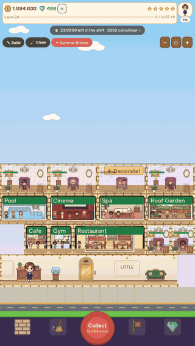
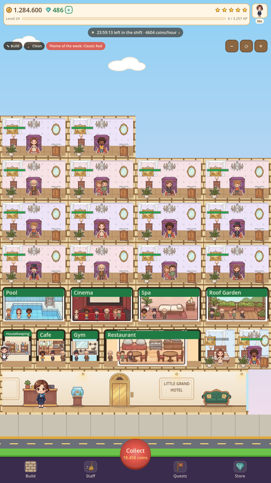
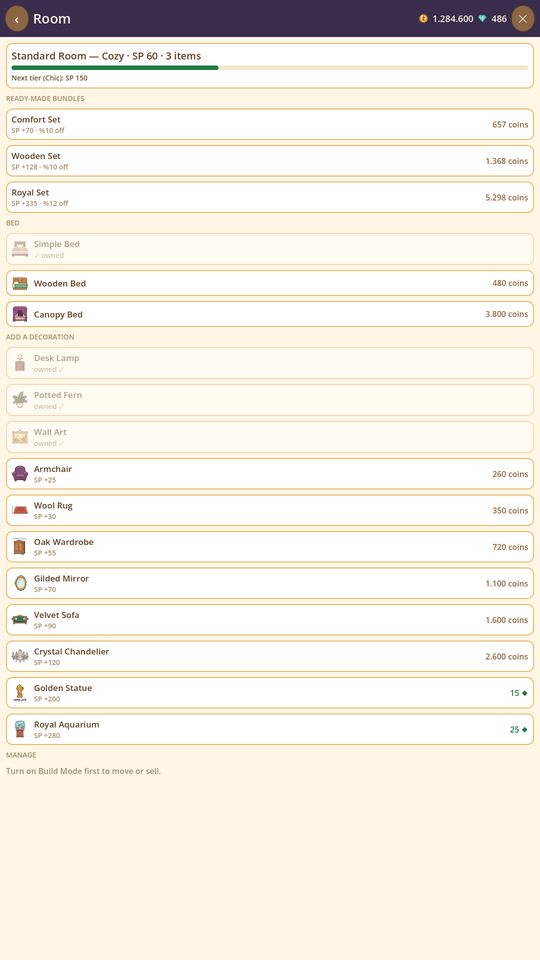
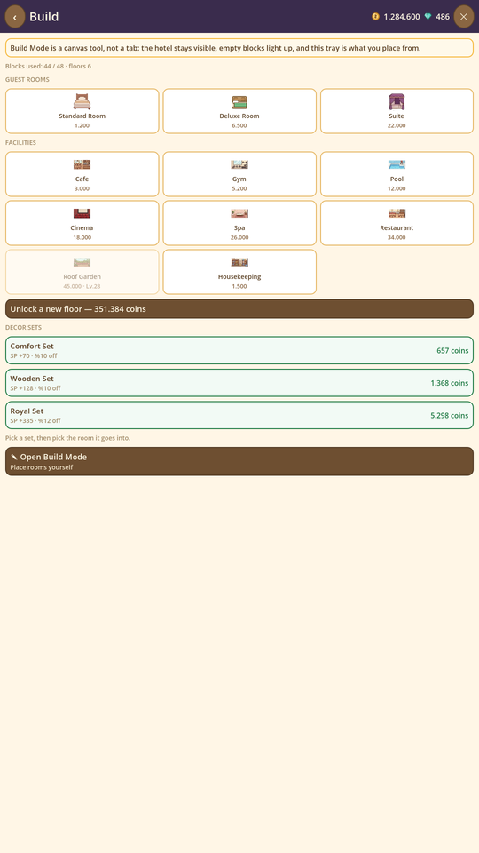
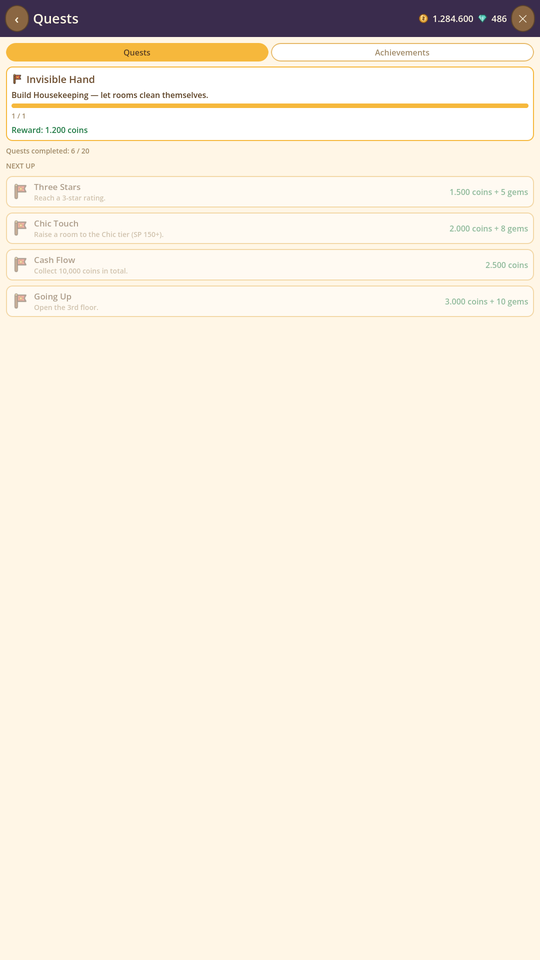

# Little Grand Hotel

Mobile hotel management and decoration game (Godot 4.7, GDScript).
Design document: GDD v1.1 — https://claude.ai/code/artifact/e65d0b6a-c8bd-4f01-ac1e-ea46c4a945cb
What's done and the roadmap: [TODO.md](TODO.md)

## Demo



| Your hotel | Decorate a room | Build | Quests |
|---|---|---|---|
|  |  |  |  |

The clip and the stills are generated, not hand-recorded: `tests/showcase.tscn`
builds a showcase hotel in memory and renders it into an offscreen 1080x1920
viewport, so the material can be regenerated after any UI change and never
depends on someone's save file.

```
tools\Godot_v4.7-stable_win64_console.exe --path . res://tests/showcase.tscn -- shots
tools\Godot_v4.7-stable_win64_console.exe --path . res://tests/showcase.tscn -- video
```

## Status: Full release — core + late game + long-term content

Core loop: room → decoration (Style Score → tier) → shift → collect income → reinvest.
Hotel City-inspired cutaway "dollhouse" look: sky + skyline, wallpapered rooms,
SVG furniture/guest art, quest chain (20 quests) and offline earnings.

Shipped with the polish release: dark bottom bar with icons, cleaning sparkle + broom
animation, flying coin animation, guest door walk-in and idle fidget animations,
procedural sound effects + lobby music, gem spending (shift skip, premium items), room
moving/selling, statistics screen, settings (sound/music, save reset) and late-game
content (Restaurant, Rooftop Garden, level 28 balance test).

Long-term additions: 13 permanent achievements, prestige system (hand over the hotel at
level 20 to earn a permanent income multiplier), serverless weekly decoration theme, a
shareable save code (export/import), and Android export (export preset + signed debug
APK). The save format is compatible with step-by-step migration from v2 onward.

Saves are also backed up to Firebase (anonymous sign-in + a single Firestore document,
over REST — Godot has no Firebase SDK). The backup is restored on every launch of the
same install, and conflicts are resolved by the player rather than merged automatically.
Google account linking — what would make a save follow the player to a *new* device — is
implemented but not yet usable: it needs an OAuth client that has not been created, so it
has never been run against a real account. Setup and reasoning:
[docs/cloud-save-setup.md](docs/cloud-save-setup.md).

Shipped with the Hotel City review release (after studying the original game's guide +
art): infestation mechanic (a room left dirty for too long costs coins to clean),
poking a sleeping guest for a secret inspector bonus, catching a runaway guest on the
street, ready-made decor bundles, capacity view in facilities; chibi characters, bellboy
and maid, a lobby scene with columns and an elevator, rich facility scenes and the room
tier meter (red→green).

## Running

The Godot 4.7 binary is expected under `tools/` (not in the repo):

```
tools\Godot_v4.7-stable_win64.exe --path .
```

## Tests (headless economy verification)

```
tools\Godot_v4.7-stable_win64_console.exe --headless --path . --script res://tests/sim_check.gd
```

## Android export

`export_presets.cfg` is included in the repo (non-Gradle build, arm64-v8a, portrait
720×1280). The following need to be set up once on the local machine only (not included
in the repo):

1. Godot 4.7 export templates → `%APPDATA%\Godot\export_templates\4.7.stable\`
   (see the [Godot export templates download page](https://godotengine.org/download))
2. Android SDK (platform-tools + build-tools 34.0.0 + platform 34), via `ANDROID_HOME`
   or by pointing to the path from Godot Editor Settings → Export → Android
3. Debug keystore: `android/debug.keystore` (gitignored; generated with `keytool`):
   ```
   keytool -genkeypair -v -keystore android/debug.keystore -storepass android ^
     -alias androiddebugkey -keypass android -keyalg RSA -keysize 2048 ^
     -validity 10000 -dname "CN=Android Debug,O=Android,C=US"
   ```

Once setup is complete, APK generation:

```
tools\Godot_v4.7-stable_win64_console.exe --headless --path . --export-debug "Android" build/android/little-grand-hotel.apk
```

## Structure

- `data/economy.json` — all balance values (GDD §5); no hardcoded numbers in code
- `data/quests.json` — quest chain (20 quests)
- `data/achievements.json` — 13 permanent achievements
- `src/autoload/game.gd` — simulation + save (independent of the UI, headless testable)
- `src/autoload/cloud_save.gd` + `src/cloud/` — Firebase cloud save and Google sign-in (REST, no SDK)
- `src/main.gd` — Hotel City-inspired dollhouse interface
- `src/sfx.gd` — procedural sound synthesis (no external audio files required)
- `assets/` — SVG art (rooms, items, guests, UI icons)
- `tests/sim_check.gd` — economy/save unit tests
- `export_presets.cfg` — Android export preset (see above)
